# Awesome MATLAB and Simulink Robotics

This is a list of awesome demos, tutorials, utilities and overall resources for the robotics community that use MATLAB and Simulink. For more information and to get your projects included in this list, reach out to <roboticsarena@mathworks.com>

- [**By Applications Areas**](#by-applications-areas)
  * [Ground Vehicles and Mobile Robotics](#ground-vehicles-and-mobile-robotics)
  * [Manipulation](#manipulation)
  * [Legged Locomotion](#legged-locomotion)
  * [Robot Modeling](#robot-modeling)
  * [Perception](#perception)
  * [Mapping, Localization and SLAM](#mapping--localization-and-slam)
  * [Motion Planning and Path Planning](#motion-planning-and-path-planning)
  * [Motion Control](#motion-control)
  * [Unmanned Aerial Vehicles (UAV)](#unmanned-aerial-vehicles--uav-)
  * [Marine Robotics](#marine-robotics-auv)
  * [Automated Driving](#automated-driving)
- [**By Common Tools**](#by-common-tools)
  * [Simulators](#simulators)
  * [ROS and Middleware](#ros-and-middleware)
  * [Hardware and Connectivity](#hardware-and-connectivity)
- [**By Relevant MATLAB Toolboxes**](#by-relevant-matlab-toolboxes)

# By Applications Areas

## Ground Vehicles and Mobile Robotics

<table>
<tbody>
<tr class="odd">
<td><ul>
<li><a href="https://www.mathworks.com/help/robotics/examples/simulate-different-kinematic-models-for-mobile-robots.html">Kinematic motion models for simulation</a></li>
<li><a href="https://www.mathworks.com/help/robotics/examples/control-and-simulate-multiple-warehouse-robots.html">Control and simulation of warehouse robots</a></li>
<li><a href="https://www.mathworks.com/videos/programming-soccer-robot-behavior-1554386041395.html">Programming of soccer robot behavior (Video)</a></li>
<li><a href="https://www.mathworks.com/videos/matlab-and-simulink-robotics-arena-programming-robot-swarms-1539080970349.html">Simulation and programming of robot swarm (Video)</a></li>
<li>Mapping, Localization and SLAM (See Section Below)</li>
<li>Motion Planning and Path Planning (See Section Below)</li>
<li><a href="https://www.mathworks.com/matlabcentral/fileexchange/66586-mobile-robotics-simulation-toolbox">Mobile Robotics Simulation Toolbox</a> (<a href="https://www.mathworks.com/videos/matlab-and-simulink-robotics-arena-getting-started-with-the-mobile-robotics-simulation-toolbox-1523443253912.html">Video</a>)</li>
<li><a href="https://www.mathworks.com/matlabcentral/fileexchange/67157-robotics-playground?s_tid=vid_recs_pers_other_v3">Robotics Playground</a> (Robotics Education - <a href="https://www.mathworks.com/videos/matlab-and-simulink-pass-competitions-hub-getting-started-with-robotics-playground-virtual-worlds-1533569380647.html">Video</a>)</li>
</ul></td>
<td>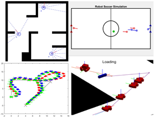</td>
</tr>
</tbody>
</table>

## Manipulation

<table>
<tbody>
<tr class="odd">
<td><ul>
<li><a href="https://www.mathworks.com/help/robotics/robot-models.html">Tools for rigid body tree dynamics and analysis</a></li>
<li><a href="https://www.mathworks.com/help/robotics/inverse-kinematics.html">Inverse Kinematics</a> (<a href="https://blogs.mathworks.com/racing-lounge/2018/04/11/robot-manipulation-part-1-kinematics/">Blog</a> and <a href="https://github.com/mathworks-robotics/designing-robot-manipulator-algorithms">GitHub Repo</a>)</li>
<li><a href="https://www.mathworks.com/help/robotics/examples/plan-a-reaching-trajectory-with-kinematic-constraints.html">Inverse kinematics with spatial constraints</a></li>
<li><a href="https://www.mathworks.com/help/robotics/examples/interactively-build-a-trajectory-abb-yumi.html">Interactive Inverse Kinematics</a></li>
<li><a href="https://www.mathworks.com/help/robotics/collision-detection.html">Collision checking</a> (<a href="https://www.mathworks.com/help/robotics/examples/check-for-manipulator-self-collisions-using-collision-meshes.html">Self-Collisions</a>, <a href="https://www.mathworks.com/help/robotics/examples/check-for-environmental-collisions-with-manipulators.html">Environment Collisions</a>)</li>
<li><a href="https://www.mathworks.com/help/robotics/trajectory-generation.html">Trajectory Generation</a> (<a href="https://blogs.mathworks.com/racing-lounge/2019/11/06/robot-manipulator-trajectory">Blog</a>, <a href="https://github.com/mathworks-robotics/trajectory-planning-robot-manipulators">GitHub Repo</a>)</li>
<li><a href="https://www.mathworks.com/help/robotics/examples/perform-safe-trajectory-tracking.html">Safe trajectory planning (Impedance based control)</a></li>
<li><a href="https://www.mathworks.com/help/robotics/examples/pick-and-place-workflow-using-stateflow.html">Pick and place workflows</a> (<a href="https://www.mathworks.com/help/robotics/examples/pick-and-place-workflow-in-gazebo-using-ros.html">Using Gazebo</a>)</li>
</ul></td>
<td>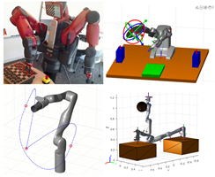</td>
</tr>
</tbody>
</table>

## Legged Locomotion

<table>
<tbody>
<tr class="odd">
<td><ul>
<li><a href="https://blogs.mathworks.com/racing-lounge/2019/12/20/walking-robot-modeling-and-simulation/">Modeling and simulation of walking robots</a> (<a href="https://github.com/mathworks-robotics/msra-walking-robot">GitHub Repo</a>)</li>
<li><a href="https://www.mathworks.com/videos/matlab-and-simulink-robotics-arena-walking-robots-pattern-generation-1546434170253.html">Pattern Generation for Walking Robots (Video)</a></li>
<li><a href="https://www.mathworks.com/videos/model-based-control-of-humanoid-walking-1574399243682.html">Linear Inverted Pendulum Model (LIPM)for humanoid walking (Video)</a></li>
<li><a href="https://www.mathworks.com/videos/deep-reinforcement-learning-for-walking-robots--1551449152203.html">Deep Reinforcement Learning for Walking Robots (Video)</a></li>
<li><a href="https://www.mathworks.com/matlabcentral/fileexchange/64237-running-robot-model-in-simscape">Modeling of quadruped robot running (Files)</a></li>
<li><a href="https://www.mathworks.com/help/reinforcement-learning/ug/quadruped-robot-locomotion-using-ddpg-gent.html">Quadruped Robot Locomotion Using DDPG Agent</a></li>
</ul></td>
<td>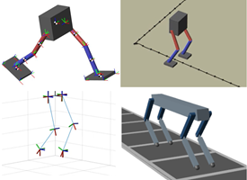</td>
</tr>
</tbody>
</table>

## Robot Modeling

<table>
<tbody>
<tr class="odd">
<td><ul>
<li><a href="https://www.mathworks.com/products/simscape.html">Simscape Tools for Modeling and Simulation of Physical Systems</a></li>
<li><a href="https://www.mathworks.com/matlabcentral/fileexchange/61370-robot-arm-with-conveyor-belts">Simulate Manipulator Actuators and Tune Control Parameters</a></li>
<li><a href="https://www.mathworks.com/help/robotics/examples/model-and-control-a-manipulator-arm-with-simscape.html">Algorithm Verification Using Robot Models</a></li>
<li><a href="https://www.mathworks.com/help/robotics/ref/importrobot.html">Import Robots to MATLAB from URDF Files</a></li>
<li><a href="https://www.mathworks.com/help/physmod/sm/cad-import.html?s_tid=CRUX_lftnav">Import Robots from CAD and URDF Files</a></li>
</ul></td>
<td>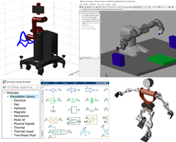</td>
</tr>
</tbody>
</table>

## Perception

<table>
<tbody>
<tr class="odd">
<td><ul>
<li><a href="https://www.mathworks.com/products/computer-vision.html#deep-learning-machine-learning">Deep Learning and Machine Learning</a></li>
<li><a href="https://www.mathworks.com/products/computer-vision.html#lidar-point-cloud-processing">Lidar and 3D Point Cloud Processing</a></li>
<li><a href="https://www.mathworks.com/products/computer-vision.html#vision-stereo-vision">3D Vision and Stereo Vision</a></li>
<li><a href="https://www.mathworks.com/products/computer-vision.html#feature-detection">Feature Detection, Extraction, and Matching</a></li>
<li><a href="https://www.mathworks.com/products/computer-vision.html#object-tracking">Object Tracking and Motion Estimation</a></li>
<li><a href="https://www.mathworks.com/help/nav/ug/estimate-orientation-through-inertial-sensor-fusion.html">Orientation Estimation from Inertial Sensors</a></li>
<li><a href="https://www.mathworks.com/help/nav/ug/reduce-drift-visual-odom-pose-graph.html">Drift Reduction for Visual Odometry</a></li>
</ul></td>
<td>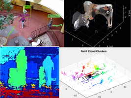</td>
</tr>
</tbody>
</table>

## Mapping, Localization and SLAM

<table>
<tbody>
<tr class="odd">
<td><ul>
<li>2D Lidar SLAM Implementations (<a href="https://www.mathworks.com/help/nav/ug/implement-simultaneous-localization-and-mapping-with-lidar-scans.html">Offline</a>, <a href="https://www.mathworks.com/help/nav/ug/implement-online-simultaneous-localization-and-mapping-with-lidar-scans.html">Online</a>)</li>
<li><a href="https://www.mathworks.com/help/nav/ug/perform-lidar-slam-using-3d-lidar-point-clouds.html">3D Lidar SLAM Implementation</a></li>
<li><a href="https://www.mathworks.com/help/nav/ref/slammapbuilder-app.html">SLAM Map Builder Application</a></li>
<li><a href="https://www.mathworks.com/help/nav/mapping.html">Occupancy Grid Utilities</a></li>
<li><a href="https://www.mathworks.com/help/nav/ug/localize-turtlebot-using-monte-carlo-localization.html">Monte Carlo Localization</a></li>
<li><a href="https://www.mathworks.com/help/nav/ug/create-egocentric-occupancy-maps-using-range-sensors.html">Ego-Centric (Near Field) Occupancy Maps</a></li>
</ul></td>
<td></td>
</tr>
</tbody>
</table>

## Motion Planning and Path Planning

<table>
<tbody>
<tr class="odd">
<td><ul>
<li><a href="https://www.mathworks.com/help/nav/motion-planning.html?s_tid=CRUX_lftnav">Motion Planners (RRT, PRM, Hybrid A*)</a></li>
<li><a href="https://www.mathworks.com/help/nav/ug/motion-planning-with-rrt-for-manipulators.html">RRT Planners for Manipulators</a></li>
<li><a href="https://www.mathworks.com/help/nav/ug/plan-mobile-robot-paths-using-rrt.html">RRT Planners for Mobile Robots</a></li>
<li><a href="https://www.mathworks.com/help/robotics/examples/path-planning-in-environments-of-difference-complexity.html">Path Planning Using Probabilistic Road Maps</a></li>
<li><a href="https://www.mathworks.com/help/nav/ug/path-following-with-obstacle-avoidance-in-simulink.html">Path Following with Obstacle Avoidance</a></li>
<li><a href="https://www.mathworks.com/help/nav/ug/dynamic-replanning-on-an-indoor-map.html">Dynamic Re-planning of Paths</a></li>
</ul></td>
<td></td>
</tr>
</tbody>
</table>

## Motion Control

<table>
<tbody>
<tr class="odd">
<td><ul>
<li><a href="https://www.mathworks.com/help/robotics/examples/avoid-obstacles-using-reinforcement-learning-for-mobile-robots.html">Obstacle Avoidance for Mobile Robots Using Reinforcement Learning</a></li>
<li><a href="https://www.mathworks.com/videos/deep-reinforcement-learning-for-walking-robots--1551449152203.html">Deep Reinforcement Learning for Walking Robots (Video)</a></li>
<li><a href="https://www.mathworks.com/help/robotics/examples/plan-and-execute-collision-free-trajectory-kinova-gen3.html">Model Predictive Control for collision-free manipulation trajectories</a></li>
<li><a href="https://github.com/mathworks-robotics/mobile-robotics-simulation-toolbox/blob/master/examples/matlab/mrsOmniwheelMPCInit.m">Model Predictive Control for holonomic robot navigation</a></li>
<li><a href="https://www.mathworks.com/help/slcontrol/ug/multi-loop-pid-control-of-a-robot-arm.html">Multi-Loop PI Control Tuning for Robotic Arm Actuators</a></li>
</ul></td>
<td>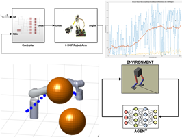</td>
</tr>
</tbody>
</table>

## Unmanned Aerial Vehicles (UAV)

<table>
<tbody>
<tr class="odd">
<td><ul>
<li><a href="https://www.mathworks.com/matlabcentral/fileexchange/68788-robotics-system-toolbox-uav-library">Simulation Library for Fixed-Wing and Multi-Rotor UAVs</a></li>
<li><a href="https://www.mathworks.com/help/robotics/examples/tuning-waypoint-follower-for-fixed-wing.html">Tune Waypoint Follower for Fixed-Wing UAV</a></li>
<li><a href="https://www.mathworks.com/help/robotics/examples/approximate-high-fidelity-uav-model-with-guidance-model.html">Approximate High-Fidelity UAV models</a></li>
<li><a href="https://www.mathworks.com/help/robotics/examples/load-and-playback-mavlink-tlog.html">Load and Playback MAVLink TLOG</a></li>
<li><a href="https://www.mathworks.com/help/robotics/examples/use-mavlink-parameter-protocol.html">Use a MAVLink Parameter Protocol for Tuning UAV Parameters in MATLAB</a></li>
<li><a href="https://www.mathworks.com/hardware-support/parrot-drone-matlab.html">Support for Parrot Drones</a></li>
<li><a href="https://www.mathworks.com/hardware-support/px4-autopilots.html">Support for PX4 Autopilots</a></li>
</ul></td>
<td>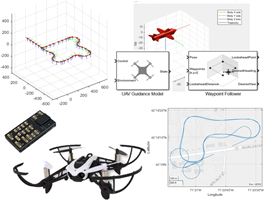</td>
</tr>
</tbody>
</table>

## Marine Robotics & AUV

<table>
<tbody>
<tr class="odd">
<td><ul>
<li><a href="https://www.mathworks.com/solutions/aerospace-defense/auv.html">AUV Development with MATLAB and Simulink</a> (<a href="https://www.mathworks.com/videos/design-modeling-and-simulation-of-autonomous-underwater-vehicles-1619636864529.html">Webinar </a>,<a href="https://www.mathworks.com/videos/series/auv-deep-dive.html">Videos </a>,<a href="https://github.com/mathworks-robotics/modeling-and-simulation-of-an-AUV-in-Simulink">GitHub Repo</a>)</li>
<li><a href="https://www.mathworks.com/videos/matlab-and-simulink-robotics-arena-direction-of-arrival-with-matlab-1504107605701.html">Estimating Direction of Arrival for AUV’s</a></li>
<li><a href="https://www.mathworks.com/videos/matlab-and-simulink-robotics-arena-from-data-to-model-1518156121608.html">System Identification for Blue Robotics Thrusters</a></li>
<li><a href="https://www.mathworks.com/videos/matlab-and-simulink-robotics-arena-lqr-control-of-an-autonomous-underwater-vehicle-1543831839770.html">LQR Control of an AUV</a></li>
<li><a href="https://www.mathworks.com/videos/modeling-and-simulation-of-an-autonomous-underwater-vehicle-1586937688878.html">Dynamics and Control of AUV’s</a> (<a href="https://github.com/mathworks/AUV-modeling-and-sim">GitHub Repo</a>)</li>
<li><a href="https://blogs.mathworks.com/racing-lounge/2019/03/18/modeling-robotic-boats-in-simulink/">Modeling Robotic Boats in Simulink</a></li>
<li><a href="https://blogs.mathworks.com/racing-lounge/2018/12/10/vmrc-getting-started/">Simulation and Control of RobotX Challenge WAM-V Boats</a></li>
</ul></td>
<td>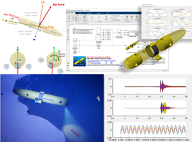</td>
</tr>
</tbody>
</table>

## Automated Driving

<table>
<tbody>
<tr class="odd">
<td><ul>
<li><a href="https://www.mathworks.com/help/driving/examples/lane-following-control-with-sensor-fusion-and-lane-detection.html">Lane Following Control with Sensor Fusion and Lane Detection</a></li>
<li><a href="https://www.mathworks.com/help/driving/examples/automate-ground-truth-labeling-for-semantic-segmentation.html">Automate Ground Truth Labeling for Semantic Segmentation</a></li>
<li><a href="https://www.mathworks.com/help/driving/examples/track-vehicles-using-lidar.html">Track Vehicles Using Lidar: From Point Cloud to Track List</a></li>
<li><a href="https://www.mathworks.com/help/driving/examples/track-level-fusion-of-radar-and-lidar-data.html">Track-Level Fusion of Radar and Lidar Data</a></li>
<li><a href="https://www.mathworks.com/help/driving/examples/visualize-automated-parking-valet-using-3d-simulation.html">Visualize Automated Parking Valet Using 3D Simulation</a></li>
<li><a href="https://www.mathworks.com/help/driving/examples/design-lidar-slam-algorithm-using-3d-simulation-environment.html">Design Lidar SLAM Algorithm Using 3D Simulation Environment</a></li>
<li><a href="https://www.mathworks.com/campaigns/offers/adaptive-cruise-control-design.html">Implementing an Adaptive Cruise Controller with Simulink</a></li>
</ul></td>
<td>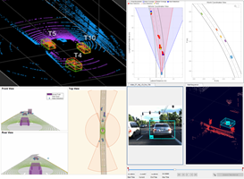</td>
</tr>
</tbody>
</table>

# By Common Tools

## Simulators

<table>
<tbody>
<tr class="odd">
<td><ul>
<li><strong>ROS – Based Simulators</strong> (See Section Below)</li>
<li><a href="https://www.mathworks.com/help/robotics/examples/perform-co-simulation-between-simulink-and-gazebo.html">Gazebo Co-Simulation</a></li>
<li><a href="https://www.mathworks.com/help/driving/unreal-engine-driving-scenario-simulation.html">UNREAL-Engine-Based Scenarios for Automated Driving</a></li>
<li><a href="https://github.com/mathworks-robotics/mobile-robotics-simulation-toolbox">Mobile Robotics Simulation Toolbox (GitHub Repo)</a></li>
<li><a href="https://github.com/mathworks-robotics/robotics-playground">Robotics Playground (GitHub Repo)</a></li>
</ul>
<td>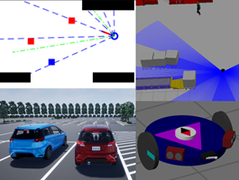</td>
</tr>
</tbody>
</table>

## ROS and Middleware

<table>
<tbody>
<tr class="odd">
<td><ul>
<li><a href="https://blogs.mathworks.com/racing-lounge/2017/11/08/matlab-simulink-ros/?doing_wp_cron=1588711755.3957149982452392578125">Getting Started with MATLAB, Simulink and ROS</a></li>
<li><a href="https://www.mathworks.com/help/ros/referencelist.html?type=function">MATLAB support for ROS and ROS 2</a></li>
<li><a href="https://www.mathworks.com/help/ros/examples.html?category=ros-in-simulink">Simulink Support for ROS and ROS 2</a></li>
<li><a href="https://www.mathworks.com/help/ros/custom-message-support.html">Support for ROS Custom Messages</a></li>
<li><a href="https://www.mathworks.com/help/ros/ug/generate-a-standalone-ros-node-from-simulink.html">Automatic ROS Node Generation from Simulink</a></li>
<li><a href="https://www.mathworks.com/videos/deploying-ros-node-on-raspberry-pi-1587374778793.html">ROS Node Generation for Raspberry Pi</a></li>
</ul></td>
<td>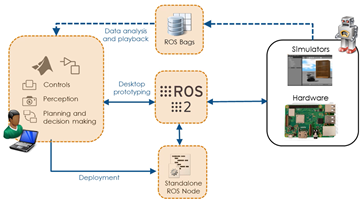</td>
</tr>
</tbody>
</table>

## Hardware and Connectivity

<table>
<tbody>
<tr class="odd">
<td><ul>
<li>Any Robot Running <strong>ROS</strong> (See ROS Section)</li>
<li><a href="https://www.mathworks.com/matlabcentral/fileexchange/65484-kinovarobotics-matlab_kinovaapi_wrapper">Kinova API</a></li>
<li><a href="https://www.mathworks.com/matlabcentral/fileexchange/67323-toyota-human-support-robot-hsr-examples">Toyota HSR Examples</a></li>
<li><a href="https://www.mathworks.com/matlabcentral/fileexchange/55578-ros-toolbox-support-package-for-turtlebot-based-robots">TurtleBot Robots</a></li>
<li><a href="https://www.mathworks.com/academia/student-competitions/vex-robotics.html">VEX Robotics</a></li>
<li><a href="https://www.mathworks.com/hardware-support/raspberry-pi-matlab.html">Raspberry Pi</a></li>
<li><a href="https://www.mathworks.com/hardware-support/beaglebone-blue.html">BeagleBone Blue</a></li>
<li><a href="https://www.mathworks.com/hardware-support/lego-mindstorms-ev3-matlab.html">LEGO Mindstorms</a></li>
<li><a href="https://www.mathworks.com/hardware-support.html">MATLAB and Simulink Hardware Support Packages</a></li>
</ul></td>
<td>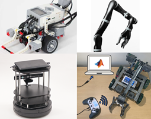</td>
</tr>
</tbody>
</table>

# By Relevant MATLAB Toolboxes

  - [Robotics System Toolbox](https://www.mathworks.com/help/robotics/examples.html)
  - [ROS Toolbox](https://www.mathworks.com/help/ros/examples.html)
  - [Navigation Toolbox](https://www.mathworks.com/help/nav/examples.html)
  - [Sensor Fusion and Tracking Toolbox](https://www.mathworks.com/help/fusion/examples.html)
  - [Computer Vision Toolbox](https://www.mathworks.com/help/vision/examples.html)
  - [Automated Driving Toolbox](https://www.mathworks.com/help/driving/examples.html)
  - [RoadRunner](https://www.mathworks.com/support/search.html?q=&fq=asset_type_name:video%20category:roadrunner/index&page=1)
  - [Deep Learning Toolbox](https://www.mathworks.com/help/deeplearning/examples.html)
  - [Reinforcement Learning Toolbox](https://www.mathworks.com/help/reinforcement-learning/examples.html)
  - [Control System Toolbox](https://www.mathworks.com/help/control/examples.html)
  - [Simscape](https://www.mathworks.com/help/physmod/simscape/examples.html)
  
Copyright 2020 The MathWorks, Inc
